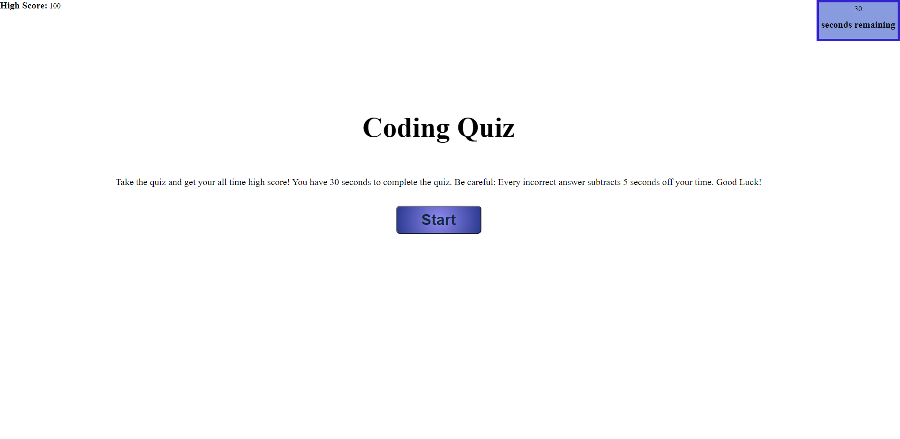

# Web API Coding Quiz

This webpage presents a timed quiz on coding. 

## Functionality

The webpage displays your saved highscore, a timer, the rules for the quiz and a start button.

When the start button is clicked, the timer countdown begins. 

Each question is multiple choice and the answer is chosen by clicking one of the options.

Each correct answer adds 20 points to their score, while each incorrect answer subtracts 5 seconds from the timer.

When each question is answered or the time has run out, the quiz ends.

The user is showed their score and then prompted to add their initials to save their best high score. 

The best highscore is then presented with their intials and will save to their local system.

## Additional Info

Deployed [Coding Quiz](https://gaitherdb.github.io/Web-API-Code-Quiz/) site on Github.

This application is made only using what we learned in class with the exception of the use of Window setTimeOut Method for additional features.

**Version 1.0**